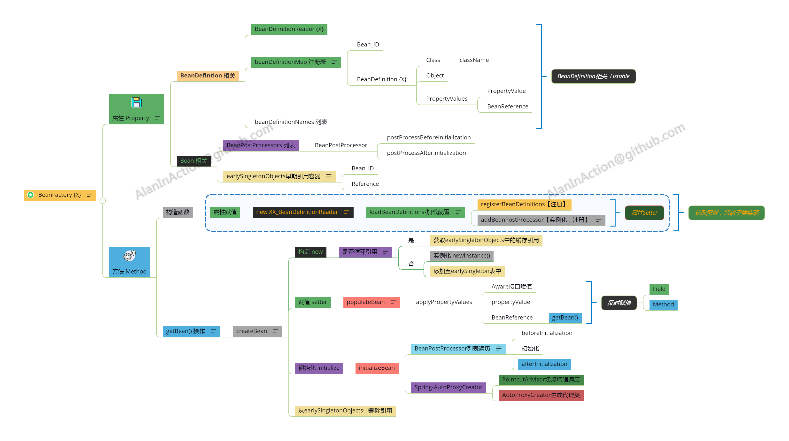
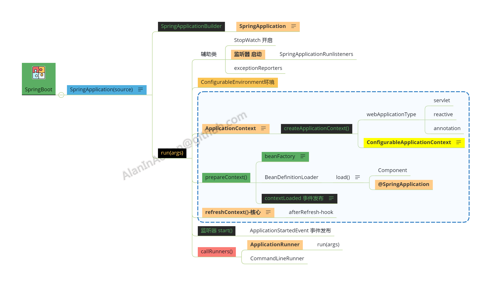

# Java-Xmind
Java With Xmind，Spring，Shiro，MyBatis，Linux，CSAPP，Assembly Laguage，DevOps【迭代中】

使用Xmind的机构化思维可以方便地学习，Java框架中【接口->抽象类->实现类】的继承层级，以及多模块之间的交互；

本文中Xmind关注于框架核心类与接口，主要为OOP思维与模块化，为方便理解，做了以下改变：

- 将封装属性的接口也归为广义的数据`data`（如Spring中`BeanDefinitionRegistry`为接口，封装了`BeanDefintion`的CRUD操作）；
- 简化，如Spring IOC中关于循环引用部分，使用`earlySingleObjects`哈希表来存引用，防止循环引用，具体实现可参考框架最新源码；

因图片显示限制，本文中的Xmind按【框架：模块：类】的层次编辑；

## Xmind索引

### 一、Java框架

#### 1.Spring

##### 1.1 IOC

###### 1.1.1 BeanFactory{X}

###### 1.1.2 BeanDefinitionReader{X}

###### 1.1.3 ApplicationContext{X}

`ApplicationContext`实现了对BeanFactory的封装，加入了消息机制，环境配置等；

##### 1.2 AOP AutoProxyCreator

#### 1.3 SpringBoot启动机制

#### 2.MyBatis

因为对象关系阻抗不匹配（`object-relational impedance mismatch`），所以需要`ORM`框架

##### 2.1 SqlSessionFactory

##### 2.2 SqlSession

#### 3.Shiro

`Shiro`为多模块框架，其中核心类`SecurityManager`实现了`Authenticator,Authorizer,SessionManager`接口；

### 二、计算机原理

#### 2.1 电路逻辑

#### 2.2 汇编语言8086

#### 2.3 CSAPP

### 三、算法

### 四、DevOps

#### 4.1 Docker运维

