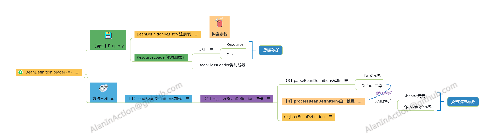

# Java-Xmind
Java With Xmind，Spring，Shiro，MyBatis，Linux，CSAPP，Assembly Laguage，DevOps【迭代中】

使用Xmind的机构化思维可以方便地学习，Java框架中【接口->抽象类->实现类】的继承层级，以及多模块之间的交互；

本文中Xmind关注于框架核心类与接口，主要为OOP思维与模块化，为方便理解，做了以下改变：

- 将封装属性的接口也归为广义的数据`data`（如Spring中`BeanDefinitionRegistry`为接口，封装了`BeanDefintion`的CRUD操作）；
- 简化，如Spring IOC中关于循环引用部分，使用`earlySingleObjects`哈希表来存引用，防止循环引用，具体实现可参考框架最新源码；

因图片显示限制，本文中的Xmind按【框架：模块：类】的层次编辑；

Table of Contents                                                                   
=================                                                                   

* [Java\-Xmind](#java-xmind)                                                        
  * [Xmind索引](#xmind%E7%B4%A2%E5%BC%95)                                             
    * [一、Java框架](#%E4%B8%80java%E6%A1%86%E6%9E%B6)                                  
      * [1\.Spring](#1spring)                                                       
        * [1\.1 IOC](#11-ioc)                                                       
          * [1\.1\.1 BeanFactory\{X\}](#111-beanfactoryx)                           
          * [1\.1\.2 BeanDefinitionReader\{X\}](#112-beandefinitionreaderx)         
          * [1\.1\.3 ApplicationContext\{X\}](#113-applicationcontextx)             
        * [1\.2 AOP](#12-aop)                                                       
      * [1\.3 SpringBoot启动机制](#13-springboot%E5%90%AF%E5%8A%A8%E6%9C%BA%E5%88%B6)   
      * [2\.MyBatis](#2mybatis)                                                     
        * [2\.1 SqlSessionFactory](#21-sqlsessionfactory)                           
        * [2\.2 SqlSession](#22-sqlsession)                                         
      * [3\.Shiro](#3shiro)                                                         
      * [4\.Netty](#4netty)                                                         
    * [二、计算机原理](#%E4%BA%8C%E8%AE%A1%E7%AE%97%E6%9C%BA%E5%8E%9F%E7%90%86)            
      * [2\.1 电路逻辑](#21-%E7%94%B5%E8%B7%AF%E9%80%BB%E8%BE%91)                       
      * [2\.2 汇编语言8086](#22-%E6%B1%87%E7%BC%96%E8%AF%AD%E8%A8%808086)               
      * [2\.3 CSAPP](#23-csapp)                                                     
    * [三、算法](#%E4%B8%89%E7%AE%97%E6%B3%95)                                          
      * [3\.1 排序](#31-%E6%8E%92%E5%BA%8F)                                           
      * [3\.2 查找](#32-%E6%9F%A5%E6%89%BE)                                           
      * [3\.3 图](#33-%E5%9B%BE)                                                     
      * [3\.4 字符串](#34-%E5%AD%97%E7%AC%A6%E4%B8%B2)                                 
    * [四、DevOps](#%E5%9B%9Bdevops)                                                  
      * [4\.1 Docker运维](#41-docker%E8%BF%90%E7%BB%B4)                               

## Xmind内容

### 一、Java框架

#### 1.Spring

##### 1.1 IOC

###### 1.1.1 BeanFactory{X}

###### 1.1.2 BeanDefinitionReader{X}

###### 1.1.3 ApplicationContext{X}

`ApplicationContext`实现了对BeanFactory的封装，加入了消息机制，环境配置等；

##### 1.2 AOP 

`AutoProxyCreator`，实现了`BeanPostProcessor`接口，根据切点`PointCut`匹配对`Bean`进行增强

#### 1.3 SpringBoot启动机制

#### 2.MyBatis

因为对象关系阻抗不匹配（`object-relational impedance mismatch`），所以需要`ORM`框架

##### 2.1 SqlSessionFactory

##### 2.2 SqlSession

#### 3.Shiro

`Shiro`为多模块框架，其中核心类`SecurityManager`实现了`Authenticator,Authorizer,SessionManager`接口；

#### 4.Netty

### 二、计算机原理

#### 2.1 电路逻辑

#### 2.2 汇编语言8086

#### 2.3 CSAPP

### 三、算法

#### 3.1 排序

#### 3.2 查找

#### 3.3 图

#### 3.4 字符串

### 四、DevOps

#### 4.1 Docker运维

